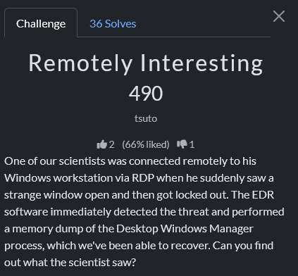
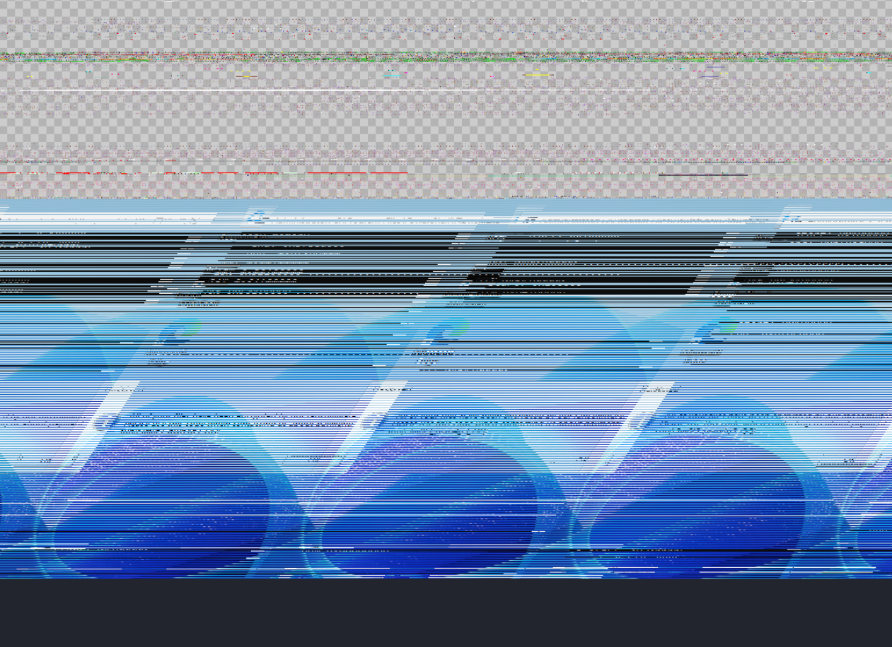
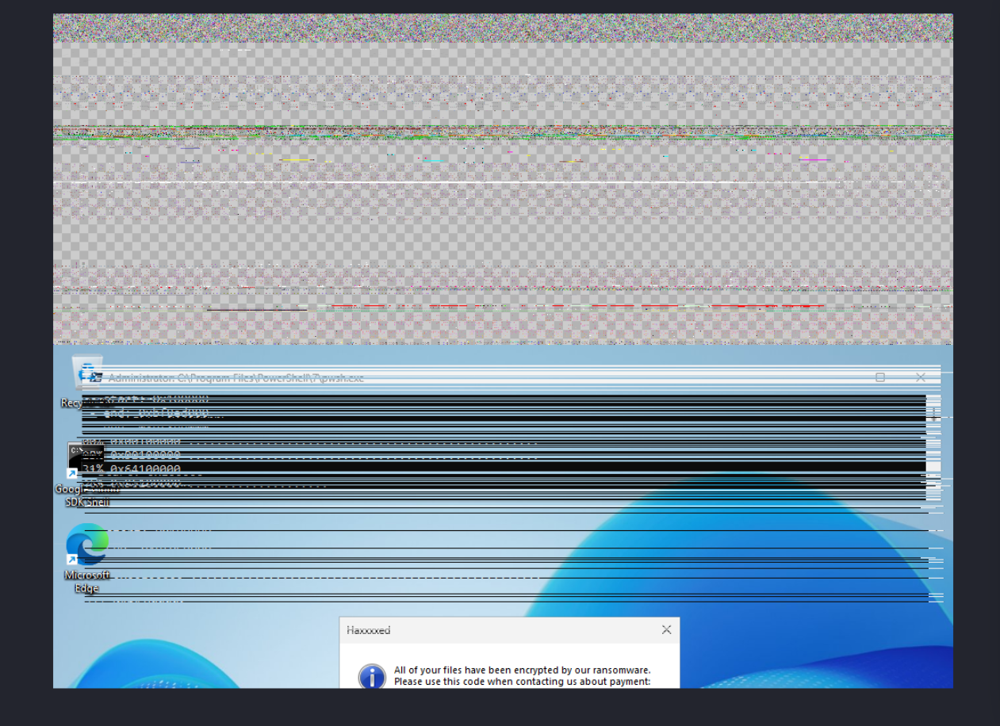

# CTF Forensics Writeup — *Recover what was last on the screen*

**Challenge prompt**

> *Recover what was last on the screen.*
> A scientist was RDP’d into a Windows workstation when a strange window flashed. The session locked out, but the EDR captured a `dwm.exe.dmp`. What was shown?



---

## My approach & thought process

If the question is literally *“what was last seen”*, the most natural artifact is a screenshot. The Desktop Window Manager (`dwm.exe`) is the compositor, it stores raw GPU surfaces for whatever windows are on screen. Those surfaces aren’t PNGs or JPEGs you can carve with `foremost`. They’re raw BGRA buffers with padded row stride.

So the plan was:
1. Prove a screenshot exists with a quick raw-slice sweep,
2. Use that partial fingerprint to anchor a focused search, 
3. Reconstruct the surface properly (respect pitch and BGRA ordering)
4. Scroll through the outputs until the ransom dialog appears in full.

---

## Step 1 — Coarse sweep for a fingerprint

I wrote a quick script to scan the dump at 16 MB intervals, trying common resolutions (1024×768, 1366×768, 1920×1080, etc.) and both RGBA/BGRA channel orders. The output was mostly junk, but one slice contained the **top of a dialog box**, heavily torn. That was the proof I needed: a screenshot existed and I had a ballpark offset.

```python
#!/usr/bin/env python3
# initial_sweep.py — coarse raw-slice sweep for screenshot fingerprints

import os, subprocess
src = "dwm.exe.dmp"
outdir = "raw_candidates"
os.makedirs(outdir, exist_ok=True)

# pick common desktop resolutions to test
sizes = [(1366,768),(1024,768),(1920,1080),(1600,900)]
step = 16 * 1024 * 1024  # 16 MiB jumps to probe the file quickly
L = os.path.getsize(src)
idx = 0

def try_slice(offset, w, h, fmt, idx):
    size = w * h * 4
    with open(src, "rb") as f:
        f.seek(offset)
        buf = f.read(size)
    if len(buf) != size:
        return False
    raw = f"{outdir}/slice_{idx:05d}_{w}x{h}_{fmt}_off{offset}.raw"
    png = raw.replace(".raw", ".png")
    open(raw, "wb").write(buf)
    try:
        subprocess.run(["convert", "-size", f"{w}x{h}", "-depth", "8", f"{fmt}:{raw}", png],
                       check=True, stdout=subprocess.DEVNULL, stderr=subprocess.DEVNULL)
        os.remove(raw)
        print("made", png)
        return True
    except Exception:
        try: os.remove(raw)
        except: pass
        return False

for offset in range(0, L, step):
    for (w,h) in sizes:
        for fmt in ("bgra","rgba"):
            try_slice(offset, w, h, fmt, idx)
            idx += 1

print("initial sweep done; check raw_candidates/")

```



---

## Step 2 — Focused reconstruction

That torn image told me the right resolution: **1024×768**. The tearing pattern meant the row pitch wasn’t `width*4` (4096 bytes), but padded. GPU textures usually align rows to 256 bytes, so I tested `3840`, `4096`, and `4352`.

I wrote a repacker that:

* Reads `pitch * height` bytes from the dump,
* Copies only `width*4` bytes from each row,
* Swaps BGRA → RGBA, forces alpha=255,
* Saves as PNG.

```python
#!/usr/bin/env python3
# repack_surface.py — read pitch*height at offset, copy width*4 from each row,
# BGRA -> RGBA, force alpha 255, save PNG.

import sys
from PIL import Image

def repack_and_save(src, offset, W, H, pitch, out):
    need = pitch * H
    with open(src, "rb") as f:
        f.seek(offset)
        buf = f.read(need)
    if len(buf) != need:
        print("FAIL: short read")
        return False

    rowbytes = W * 4
    tight = bytearray(W * H * 4)
    for y in range(H):
        row = buf[y * pitch : y * pitch + rowbytes]
        if len(row) < rowbytes:
            print("FAIL: short row")
            return False
        # BGRA -> RGBA, set alpha = 255
        for x in range(0, rowbytes, 4):
            b = row[x+0]
            g = row[x+1]
            r = row[x+2]
            idx = (y * rowbytes) + x
            tight[idx + 0] = r
            tight[idx + 1] = g
            tight[idx + 2] = b
            tight[idx + 3] = 255

    Image.frombytes("RGBA", (W, H), bytes(tight)).save(out, optimize=True)
    return True

if __name__ == "__main__":
    if len(sys.argv) != 7:
        print("usage: repack_surface.py dump offset width height pitch out.png")
        sys.exit(1)
    src = sys.argv[1]
    offset = int(sys.argv[2])
    W = int(sys.argv[3])
    H = int(sys.argv[4])
    pitch = int(sys.argv[5])
    out = sys.argv[6]
    ok = repack_and_save(src, offset, W, H, pitch, out)
    print("OK" if ok else "FAIL")

```

Focused sweep loop:

```bash
BASE=16777216         # the rough anchor from the coarse slice
SPAN=524288           # +/- 512 KiB
STEP=4096             # 4 KiB step
W=1024; H=768
PITCHES=(3840 4096 4352)

mkdir -p png_1024x768_scan
for off in $(seq $((BASE - SPAN)) $STEP $((BASE + SPAN))); do
  for p in "${PITCHES[@]}"; do
    out=png_1024x768_scan/cand_off${off}_p${p}.png
    python3 repack_surface.py dwm.exe.dmp $off $W $H $p $out >/dev/null 2>&1 || true
    [ -f "$out" ] && [ $(stat -c%s "$out") -lt 20000 ] && rm -f "$out"
  done
done

ls -S png_1024x768_scan/*.png | head -20

```

---

## Step 3 — Scroll until it appears

Scrolling through the outputs manually, the striped garbage gave way to a clear screenshot. The ransom dialog was fully visible in `png_1024x768_scan/cand_off17158144_p4096.png`.


And there it was:
**`FLAG{REDACTED}`**

---

## Takeaways

* If a CTF asks *“what was last seen”*, go looking for screenshots in DWM.
* A single torn image is all you need — it proves the surface is there and gives you the anchor offset.
* Don’t fight the stripes. They’re just row padding. Handle pitch and BGRA properly, and the screen snaps back into place.
* The fastest workflow: coarse sweep → anchor → focused repack → manual scroll.

---

**Flag:** `REDACTED`

Would you like me to polish this further into a *LinkedIn post format* (with intro hook, bullet highlights, and a “lessons learned” ending), or keep it in CTF writeup style for the hacker audience?
